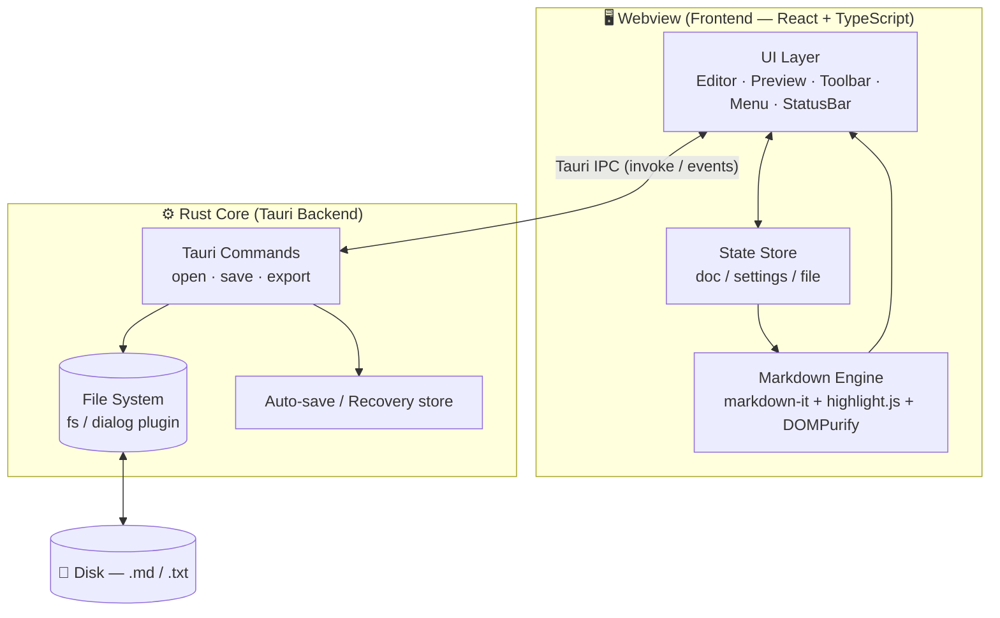
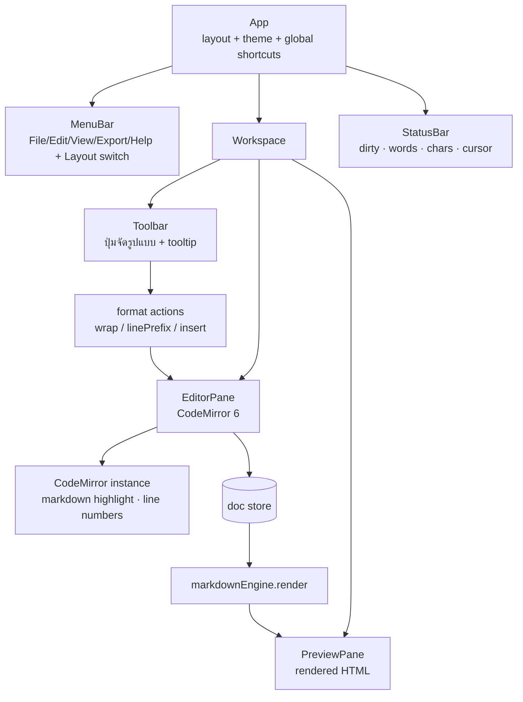
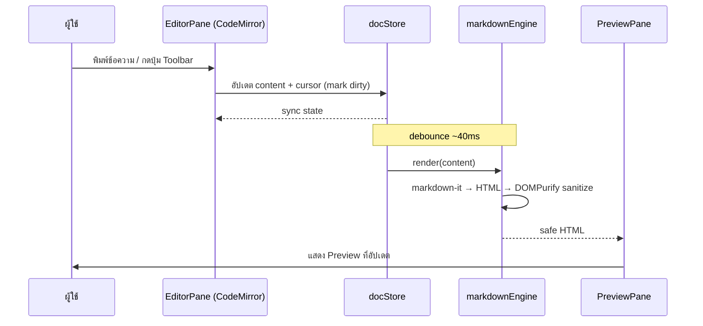
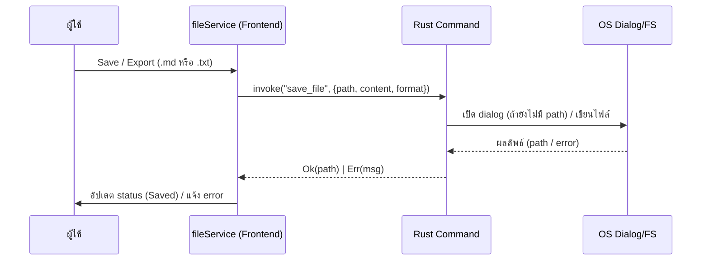

# Features & Architecture — PlainMark

> สถาปัตยกรรมระบบ การแบ่ง module และ feature ทั้งหมด สำหรับแอปเดสก์ท็อปที่สร้างด้วย **Tauri**
> อ่านคู่กับ `PRD.md` (requirement) และ `tech-stack.md` (เทคโนโลยี)

---

## 1. มุมมองสถาปัตยกรรมระดับสูง (High-Level Architecture)

PlainMark เป็นแอป **Tauri** = **Frontend (Webview)** + **Rust Core (Native)** สื่อสารผ่าน Tauri IPC



**หลักการแบ่งความรับผิดชอบ**
- **Webview** จัดการทุกอย่างที่เกี่ยวกับ UI และการ render Markdown (เร็ว, อยู่ใน process เดียว)
- **Rust Core** จัดการสิ่งที่ต้องเข้าถึง native: เปิด/บันทึก/export ไฟล์, dialog, auto-save ลงดิสก์
- การ render Markdown ทำฝั่ง frontend ทั้งหมด → ไม่ต้องวิ่งข้าม IPC ทุก keystroke (ลื่น)

---

## 2. สถาปัตยกรรม Frontend (Component Architecture)



### 2.1 รายการ Component หลัก
| Component | หน้าที่ | Feature ที่รองรับ |
|---|---|---|
| `App` | จัด layout, theme, ลงทะเบียน global shortcut, จัดการ lifecycle | FR-7..11, theme, shortcuts |
| `MenuBar` | เมนู File/Edit/View/Export/Help + สลับ layout (Split/Editor/Preview) | FR-10, FR-23..27 |
| `EditorPane` | ห่อ CodeMirror 6, รับ input, expose API ให้ Toolbar | FR-1..6 |
| `PreviewPane` | แสดง HTML ที่ render + sanitize แล้ว, sync scroll | FR-7..9, FR-11 |
| `Toolbar` | ปุ่มจัดรูปแบบ Markdown ทั้ง 11 กลุ่ม + tooltip/shortcut hint | FR-12..22 |
| `ToolbarTip` | ป๊อปอัป tooltip ที่ render **ตัวอย่างผลลัพธ์จริง** ของแต่ละปุ่ม (preview) + syntax + shortcut เมื่อ hover/focus | FR-30 |
| `StatusBar` | dirty state, word/char count, ตำแหน่ง cursor, encoding | FR-6, FR-28 |
| `Dialogs` | Link/Image dialog, unsaved-changes prompt, export picker | FR-18, FR-19, FR-28 |

### 2.2 Module (Logic — แยกจาก UI)
| Module | ความรับผิดชอบ |
|---|---|
| `markdownEngine` | กำหนดค่า markdown-it (GFM-like) + highlight.js + DOMPurify → `render(md): safeHtml` |
| `formatActions` | logic การจัดรูปแบบ: `wrap()`, `linePrefix()`, `insert()`, `toggleHeading()` — รับ/คืนค่า selection |
| `imagePaste` | ดักจับ paste/drop รูป → อ่านเป็น base64 (`FileReader.readAsDataURL`) → แทรกแบบ reference-style ลง editor | FR-31..33 |
| `toolbarTips` | นิยามข้อมูล tooltip ของแต่ละปุ่ม (ชื่อ, ตัวอย่าง render, syntax, shortcut) — ใช้ `markdownEngine` สร้าง preview ตัวอย่าง | FR-30 |
| `shortcuts` | mapping คีย์ลัด → format action / command |
| `fileService` | สะพานเรียก Tauri commands: `open`, `save`, `saveAs`, `export` |
| `autosave` | debounce เขียน draft ลง storage ผ่าน Rust; กู้คืนตอนเปิดแอป |
| `settings` | theme, layout, line-number, recent files (persist) |
| `docStore` | state ของเอกสาร: content, filePath, dirty, cursor |

---

## 3. Data Flow — จากพิมพ์ถึง Preview



**จุดสำคัญด้าน performance**
- Render ถูก **debounce** (~40ms) — ไม่ render ทุก keystroke
- markdown-it ทำงานเร็วและ synchronous; งานใหญ่จริงค่อยพิจารณา Web Worker (post-MVP)
- Preview ใช้การแทน HTML ทั้งก้อนใน MVP; ถ้าเอกสารใหญ่มากค่อยทำ incremental/virtualized render

---

## 4. Data Flow — ไฟล์ & Export (ข้าม IPC)



- **Export `.md`** = เขียน content ดิบลงไฟล์นามสกุล `.md`
- **Export `.txt`** = เขียน content เดียวกันลง `.txt` (ข้อความล้วน — Markdown source ก็คือ plain text อยู่แล้ว)
- การเข้าถึงไฟล์ผ่าน Rust + Tauri permission ที่จำกัด ปลอดภัยกว่าให้ webview แตะ FS ตรงๆ

---

## 4.1 Data Flow — วางรูปภาพ (Image Paste / Drop → base64)

ผู้ใช้ก็อปรูปจากที่อื่นแล้ววาง (`Ctrl+V`) หรือ ลากไฟล์รูปลงช่อง editor — รูปถูกฝังเป็น base64 **ในฝั่ง frontend ทั้งหมด ไม่ต้องเขียนไฟล์ลงดิสก์ก่อน**

```mermaid
sequenceDiagram
    participant U as ผู้ใช้
    participant E as EditorPane
    participant IP as imagePaste
    participant FR as FileReader (Webview)
    participant S as docStore
    participant P as PreviewPane

    U->>E: Ctrl+V (paste) หรือ drop ไฟล์รูป
    E->>IP: paste/drop event (มี image item/file)
    IP->>FR: readAsDataURL(file)
    FR-->>IP: data:image/png;base64,…
    IP->>S: แทรก reference-style<br/>`![alt][imgN]` + `[imgN]: data:…`
    S->>P: render (markdownEngine + DOMPurify)
    P->>U: แสดงรูปใน preview ทันที
```

**เหตุผลเชิงออกแบบ**
- **ไม่ต้องเซฟไฟล์ก่อน** — ตรงตาม FR-31; data URL ฝังในเอกสารเลย เปิดที่อื่นก็เห็นรูป
- **เก็บแบบ reference-style** (FR-33) — `![alt][imgN]` อยู่ในเนื้อความ ส่วน base64 ยาวๆ ไปกองท้ายไฟล์ → editor ยังอ่านง่าย (CodeMirror รองรับ fold บรรทัด reference ได้)
- **Security:** DOMPurify อนุญาต `data:image/*` ใน `src` แต่บล็อก data URI ที่เป็น script/HTML — กัน XSS ผ่าน data URL
- **Trade-off:** ไฟล์ `.md` ใหญ่ขึ้นตามรูป — ยอมรับได้สำหรับโน้ต/เอกสารสั้น (asset management ขั้นสูงอยู่ใน post-MVP)

---

## 5. แผนผังฟีเจอร์ → Component → Requirement (Traceability)

| Feature | UI Component | Module | Requirement |
|---|---|---|---|
| พิมพ์ข้อความ text-first | EditorPane | docStore | FR-1, FR-2 |
| เลขบรรทัด / syntax highlight ใน editor | EditorPane (CodeMirror) | — | FR-3, FR-4 |
| Markdown Preview เรียลไทม์ | PreviewPane | markdownEngine | FR-7 |
| Sync scroll | EditorPane ↔ PreviewPane | — | FR-8 |
| Code syntax highlight | PreviewPane | markdownEngine (highlight.js) | FR-9 |
| สลับ layout | MenuBar | settings | FR-10 |
| Sanitize HTML | PreviewPane | markdownEngine (DOMPurify) | FR-11 |
| Toolbar 11 กลุ่ม | Toolbar | formatActions | FR-12..22 |
| Tooltip ตัวอย่างผลลัพธ์ | ToolbarTip | toolbarTips, markdownEngine | FR-30 |
| วางรูป/ลากรูป → base64 | EditorPane | imagePaste | FR-31..33 |
| Shortcuts | App | shortcuts | FR-12..22 |
| New/Open/Save/SaveAs | MenuBar, Dialogs | fileService (Rust) | FR-23..25 |
| Export .md / .txt | MenuBar, Dialogs | fileService (Rust) | FR-26, FR-27 |
| Dirty-state guard | StatusBar, Dialogs | docStore | FR-28 |
| Recent files | MenuBar | settings | FR-29 |
| Auto-save / recovery | (background) | autosave (Rust) | NFR Reliability |
| Light/Dark theme | App, MenuBar | settings | NFR Usability |
| Word/char count | StatusBar | docStore | FR-6 |

---

## 6. โครงสร้างโปรเจกต์ (Project Structure)

```
plainmark/
├── src/                          # Frontend (React + TypeScript)
│   ├── main.tsx                  # entry
│   ├── App.tsx
│   ├── components/
│   │   ├── MenuBar.tsx
│   │   ├── Workspace.tsx
│   │   ├── EditorPane.tsx        # ห่อ CodeMirror 6
│   │   ├── PreviewPane.tsx
│   │   ├── Toolbar.tsx
│   │   ├── ToolbarTip.tsx        # tooltip ตัวอย่างผลลัพธ์ (FR-30)
│   │   ├── StatusBar.tsx
│   │   └── dialogs/
│   │       ├── LinkDialog.tsx
│   │       ├── ImageDialog.tsx
│   │       └── UnsavedDialog.tsx
│   ├── lib/
│   │   ├── markdownEngine.ts     # markdown-it + highlight.js + DOMPurify
│   │   ├── formatActions.ts      # wrap / linePrefix / insert / toggleHeading
│   │   ├── imagePaste.ts         # paste/drop → base64 reference-style (FR-31..33)
│   │   ├── toolbarTips.ts        # ข้อมูล tooltip ตัวอย่างผลลัพธ์ (FR-30)
│   │   ├── shortcuts.ts
│   │   ├── fileService.ts        # invoke Tauri commands
│   │   └── autosave.ts
│   ├── store/
│   │   ├── docStore.ts           # content/file/dirty/cursor
│   │   └── settingsStore.ts      # theme/layout/recent
│   ├── styles/
│   │   ├── theme.css             # CSS variables (light/dark)
│   │   └── preview.css           # สไตล์ของ rendered markdown
│   └── types/
│
├── src-tauri/                    # Rust Core
│   ├── src/
│   │   ├── main.rs
│   │   ├── commands.rs           # open_file / save_file / export_file
│   │   └── autosave.rs           # draft persistence + recovery
│   ├── capabilities/             # Tauri v2 permission (fs/dialog scope)
│   ├── tauri.conf.json
│   └── Cargo.toml
│
├── tests/                        # Vitest (frontend) + Rust tests
├── docs/                         # PRD / user-journey / tech-stack / plan
├── package.json
└── README.md
```

---

## 7. State Model (สรุป)

```ts
// docStore
interface DocState {
  content: string;          // ข้อความ Markdown ดิบ
  filePath: string | null;  // null = ยังไม่เคย save
  dirty: boolean;           // มีการแก้ที่ยังไม่บันทึก
  cursor: { line: number; col: number };
}

// settingsStore (persist)
interface Settings {
  theme: 'light' | 'dark' | 'system';
  layout: 'split' | 'editor' | 'preview';
  showLineNumbers: boolean;
  recentFiles: string[];    // สูงสุด N ไฟล์
}
```

---

## 8. ความปลอดภัย (Security Architecture)

| ความเสี่ยง | มาตรการ | ที่ตั้ง |
|---|---|---|
| XSS จาก HTML/`<script>` ใน Markdown | **DOMPurify** sanitize ผลลัพธ์ทุกครั้งก่อน render | `markdownEngine` |
| `javascript:` ใน link/image | กรอง URL scheme (อนุญาตเฉพาะ http/https/mailto/relative) | `markdownEngine` |
| รูปที่วาง = `data:` URL อันตราย | อนุญาตเฉพาะ `data:image/*` ใน `src`; บล็อก `data:text/html`/script ด้วย DOMPurify | `markdownEngine`, `imagePaste` |
| การเข้าถึงไฟล์เกินจำเป็น | Tauri v2 **capabilities/permissions** จำกัด scope fs+dialog เท่าที่ใช้ | `src-tauri/capabilities` |
| CSP ของ webview | ตั้ง Content-Security-Policy ใน `tauri.conf.json` | Tauri config |
| ข้อมูลรั่วออกนอกเครื่อง | ไม่มี network call; offline 100%; ไม่มี telemetry | ทั้งระบบ |

---

## 9. การจัดการ Performance & Reliability

- **Debounced render** (~40ms) แยกการพิมพ์ออกจากการ render
- **Auto-save** debounce ~2s เขียน draft ผ่าน Rust; เก็บไฟล์ recovery แยกจากไฟล์จริง
- **Crash recovery:** เปิดแอป → ตรวจ draft ที่ค้าง → ถามผู้ใช้ว่ากู้คืนหรือไม่
- **Lazy load:** highlight.js โหลดเฉพาะภาษาที่ใช้บ่อย (ลด bundle)
- **Large doc (post-MVP):** ย้าย parser ไป Web Worker + virtualized preview

---

## 10. จุดขยายในอนาคต (Extensibility Hooks)
- `markdownEngine` รับ plugin ของ markdown-it ได้ (footnote, emoji, container) — เปิดทางฟีเจอร์ Extended เพิ่ม
- ระบบ Export แยกเป็น strategy (`.md`, `.txt` ตอนนี้ → เพิ่ม `.html`, `.pdf`, `.docx` ภายหลัง)
- `settingsStore` พร้อมรองรับ custom preview CSS / theme เพิ่มเติม
- โครง command ใน Rust พร้อมเพิ่ม workspace/หลายไฟล์ในอนาคต
