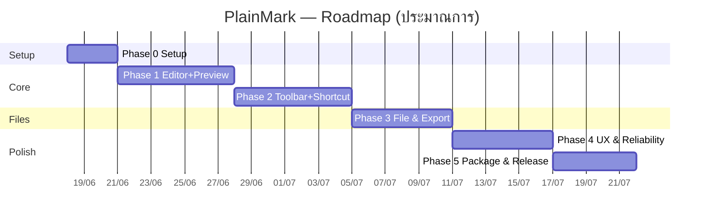

# Project Plan — PlainMark

> แผนการพัฒนาเป็นเฟส พร้อม milestone, งานย่อย, ประมาณการ, ความเสี่ยง และ Definition of Done
> อ้างอิง `PRD.md`, `features_architecture.md`, `tech-stack.md`

---

## 1. ภาพรวมแผน

- **รูปแบบ:** Incremental — ปล่อย MVP ที่ใช้งานได้จริงก่อน แล้วต่อยอด
- **สมมติฐานทีม:** dev 1–2 คน (full-stack), part/full-time
- **ประมาณการรวมถึง MVP:** ~6 สัปดาห์ (ปรับตามขนาดทีม)
- **หลักการ:** ทุกเฟสจบด้วยสิ่งที่ "รันได้และทดสอบได้"

---

## 2. เฟสและงานย่อย

### Phase 0 — Project Setup (≈ 3 วัน)
**เป้าหมาย:** โครงโปรเจกต์รันได้ทั้ง frontend + Tauri
- [ ] ตั้งโปรเจกต์ Tauri 2 + React + TypeScript + Vite
- [ ] ตั้ง ESLint/Prettier, โครงโฟลเดอร์ตาม `features_architecture.md` ข้อ 6
- [ ] ตั้ง Vitest + ตัวอย่าง test, GitHub repo + Actions เปล่า
- [ ] ใส่ CSS variables theme (light/dark) เปล่าๆ
- **DoD:** `npm run tauri dev` เปิดหน้าต่างว่างได้ทั้ง dev/build; CI เขียว

### Phase 1 — Core Editor + Live Preview (≈ 1 สัปดาห์) — **MVP กระดูกสันหลัง**
**เป้าหมาย:** พิมพ์ฝั่งซ้าย เห็น Markdown ฝั่งขวาเรียลไทม์
- [ ] ฝัง CodeMirror 6 ใน `EditorPane` (line number, markdown highlight) — FR-1..4
- [ ] `markdownEngine`: markdown-it + highlight.js + DOMPurify — FR-7, FR-9, FR-11
- [ ] `PreviewPane` render + debounce ~40ms — FR-7
- [ ] `docStore` (Zustand): content/cursor/dirty
- [ ] Layout split + สลับ Split/Editor/Preview — FR-10
- [ ] Sync scroll editor ↔ preview — FR-8
- [ ] StatusBar: word/char count, cursor pos — FR-6
- **DoD:** พิมพ์ Markdown แล้ว preview ถูกต้องตาม cheat sheet (Basic) เรียลไทม์; ผ่าน test ของ markdownEngine

### Phase 2 — Toolbar + Shortcuts (≈ 1 สัปดาห์) — **จุดขายหลัก**
**เป้าหมาย:** จัดรูปแบบได้โดยไม่ต้องจำ syntax
- [ ] `formatActions`: `wrap()`, `linePrefix()`, `insert()`, `toggleHeading()` (รองรับมี/ไม่มี selection)
- [ ] `Toolbar` ปุ่มครบ 11 กลุ่ม + tooltip + แสดง shortcut — FR-12..22
- [ ] Heading toggle/วนระดับ H1–H6 — FR-12
- [ ] Table template, Code block + เลือกภาษา, List (bullet/number/task) — FR-15, FR-16, FR-20
- [ ] Link/Image dialog — FR-18, FR-19
- [ ] `ToolbarTip` + `toolbarTips`: tooltip แสดงตัวอย่างผลลัพธ์ + syntax + shortcut เมื่อ hover/focus — FR-30
- [ ] `shortcuts`: ผูกคีย์ลัดทั้งหมด — FR-12..22
- **DoD:** ทุกปุ่ม/ทุก shortcut ทำงานถูกทั้งกรณีมี/ไม่มี selection; hover แล้วเห็นตัวอย่างผลลัพธ์; มี test ของ formatActions

### Phase 3 — File & Export (≈ 6 วัน)
**เป้าหมาย:** เปิด/บันทึก/ส่งออกไฟล์จริง
- [ ] Rust commands: `open_file`, `save_file`, `save_as`, `export_file` — FR-23..27
- [ ] ตั้ง Tauri capabilities/permission (fs + dialog scope) — Security
- [ ] `fileService` ฝั่ง frontend (invoke + จัดการ error)
- [ ] New/Open/Save/Save As ผูกกับเมนู + shortcut (Ctrl+N/O/S) — FR-23..25
- [ ] Export `.md` และ `.txt` — FR-26, FR-27
- [ ] `imagePaste`: วางรูปจาก clipboard (Ctrl+V) + ลากวาง → ฝัง base64 reference-style; กำหนด DOMPurify ให้อนุญาตเฉพาะ `data:image/*` — FR-31..33
- [ ] Dirty-state guard ก่อนปิด/เปิดไฟล์ใหม่ — FR-28
- **DoD:** open→แก้→save→reopen ได้ครบ; export ทั้งสองนามสกุลถูกต้อง; ก็อปรูปแล้ววางฝังได้และเซฟติดไปกับไฟล์; ทดสอบ permission scope

### Phase 4 — UX Polish & Reliability (≈ 6 วัน)
**เป้าหมาย:** ใช้งานจริงได้อย่างมั่นใจ
- [ ] Auto-save (debounce ~2s) + crash recovery ผ่าน Rust — NFR Reliability
- [ ] Recent files — FR-29
- [ ] Light/Dark/System theme เสร็จสมบูรณ์ + persist settings
- [ ] Accessibility: keyboard เข้าถึงครบ, contrast AA, font scaling
- [ ] รองรับภาษาไทยใน editor/preview/export (Unicode/IME)
- [ ] จัดการ edge cases ตาม `user-journey.md` ข้อ 5
- **DoD:** ปิดกะทันหันแล้วกู้คืนได้; ผ่าน accessibility checklist; edge cases ไม่ทำแอป crash

### Phase 5 — Packaging & Release (≈ 5 วัน)
**เป้าหมาย:** แจกจ่ายได้จริง
- [ ] ปรับ `tauri.conf.json` (CSP, icon, metadata, ขนาดหน้าต่าง)
- [ ] Build installer: Windows (NSIS), macOS (dmg), Linux (AppImage/deb)
- [ ] GitHub Actions matrix build + แนบ artifact ใน Release
- [ ] เขียน README (ติดตั้ง + clone/build จาก Git) + คู่มือสั้น
- [ ] วัด performance/footprint เทียบ target (ข้อ 3.2/7 ของ PRD)
- **DoD:** ดาวน์โหลด installer ติดตั้งและใช้งานได้ทั้ง 3 OS; ผ่านเกณฑ์ขนาด/ความเร็ว; tag release v1.0

---

## 3. MVP vs Post-MVP

| ขอบเขต | รวมใน MVP (Phase 1–3, ส่วนหนึ่งของ 4–5) |
|---|---|
| ✅ MVP | Editor + live preview, Toolbar 11 กลุ่ม + shortcuts, **tooltip ตัวอย่างผลลัพธ์**, **วางรูป clipboard/ลากวาง → ฝัง base64**, Open/Save/SaveAs, Export .md/.txt, Light/Dark, auto-save |
| ⏳ Post-MVP | Export .html/.pdf/.docx, จัดการ asset รูปขั้นสูง (แยกไฟล์/บีบอัด/แกลเลอรี), หลายแท็บ/workspace, custom preview CSS, Outline/TOC, Find & Replace, footnote/emoji, cloud sync (opt-in) |

---

## 4. Milestones สำคัญ

| Milestone | เมื่อจบ Phase | เกณฑ์ |
|---|---|---|
| **M1 — "It renders"** | Phase 1 | พิมพ์แล้วเห็น Markdown เรียลไทม์ |
| **M2 — "No syntax needed"** | Phase 2 | จัดรูปแบบครบผ่านปุ่ม/คีย์ลัด |
| **M3 — "It saves"** | Phase 3 | เปิด/บันทึก/export ไฟล์จริงได้ |
| **M4 — "Trustworthy"** | Phase 4 | auto-save/recovery + polish |
| **M5 — "Shippable v1.0"** | Phase 5 | installer ครบ 3 OS + release |

---

## 5. ความเสี่ยง & การรับมือ

| ความเสี่ยง | ผลกระทบ | โอกาส | การรับมือ |
|---|---|---|---|
| Webview ต่างกันข้าม OS | บั๊กเฉพาะ OS | กลาง | ทดสอบทั้ง 3 OS ตั้งแต่ Phase 1; เลี่ยง CSS/JS ที่รองรับแคบ |
| Preview ช้าเมื่อเอกสารใหญ่ | UX แย่ | กลาง | debounce; เตรียม Web Worker + virtualized render (post-MVP) |
| Rendering ไม่ตรง GitHub | ผู้ใช้สับสน | กลาง | config markdown-it ให้ใกล้ GFM + ชุด test เทียบผล |
| ความซับซ้อนของ CodeMirror | ดีเลย์ Phase 1–2 | กลาง | เริ่มจาก setup ขั้นต่ำ เพิ่ม extension ทีละตัว |
| XSS จาก HTML ใน Markdown | ความปลอดภัย | ต่ำ | DOMPurify บังคับใช้ + test ด้าน security |
| ขอบเขตบานปลาย (เพิ่มฟีเจอร์) | ปล่อยช้า | กลาง | ยึด MVP scope; ฟีเจอร์ใหม่เข้าคิว post-MVP |

---

## 6. Definition of Done (รวมทั้งโปรเจกต์)

ฟีเจอร์/งานถือว่าเสร็จเมื่อ:
- [ ] ทำงานตรงตาม requirement ที่ map ไว้ใน `features_architecture.md` ข้อ 5
- [ ] มี unit/component test สำหรับ logic หลัก และผ่านทั้งหมด
- [ ] ผ่าน lint/format และ build สำเร็จทั้ง dev/release
- [ ] ทดสอบมือบนอย่างน้อย 2 OS (รวม Windows)
- [ ] ไม่มี error/warning ใน console; ไม่มี regression
- [ ] อัปเดตเอกสาร/README หากพฤติกรรมเปลี่ยน

---

## 7. กิจกรรมต่อเนื่อง (ตลอดโปรเจกต์)
- เขียน test ควบคู่การพัฒนา (ไม่ทิ้งท้าย)
- ทดสอบข้าม OS ทุกครั้งที่จบ milestone
- ทบทวน performance/footprint เทียบ target เป็นระยะ
- รวบรวม feedback ผู้ใช้จริงตั้งแต่ M1 เพื่อปรับ UX

---

## 8. สรุปไทม์ไลน์ (อ้างอิงเริ่ม 2026-06-18)

| Phase | ระยะ | ประมาณวันจบ |
|---|---|---|
| 0 — Setup | 3 วัน | ~20 มิ.ย. 2026 |
| 1 — Editor + Preview | 7 วัน | ~27 มิ.ย. 2026 |
| 2 — Toolbar + Shortcuts | 7 วัน | ~4 ก.ค. 2026 |
| 3 — File & Export | 6 วัน | ~10 ก.ค. 2026 |
| 4 — UX & Reliability | 6 วัน | ~16 ก.ค. 2026 |
| 5 — Package & Release | 5 วัน | ~21 ก.ค. 2026 |

> ประมาณการสำหรับทีม 1–2 คน — ปรับได้ตามจริง; เน้นให้แต่ละ Phase ส่งมอบของที่ใช้งานได้
