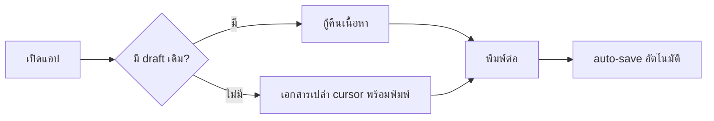
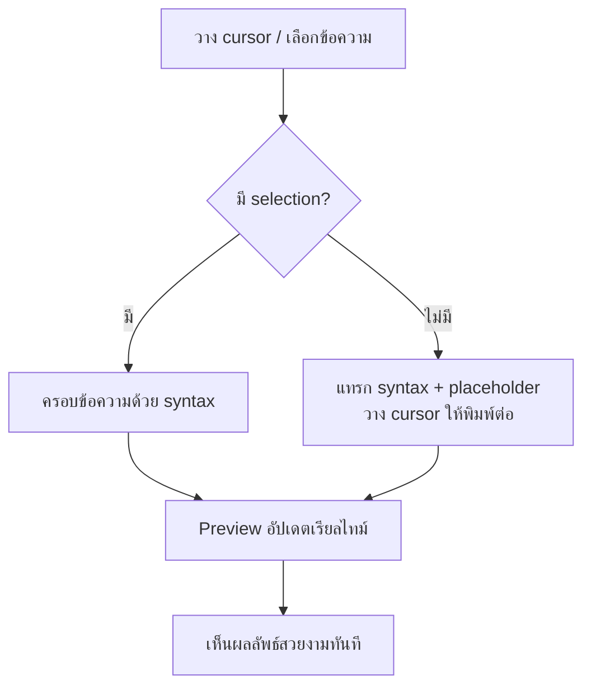
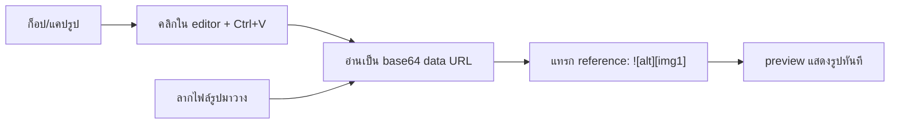
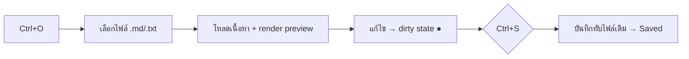
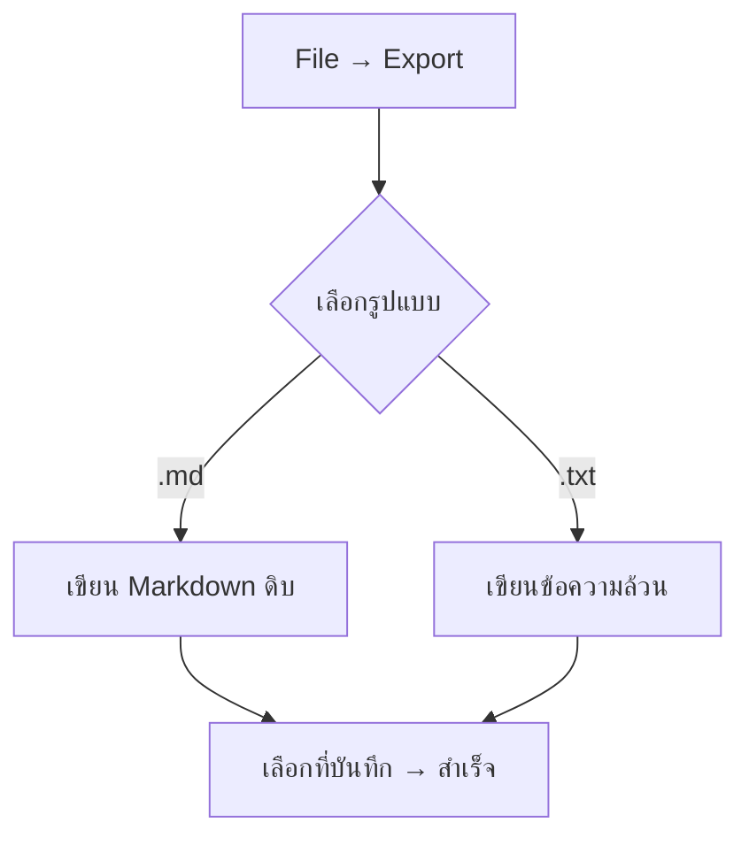
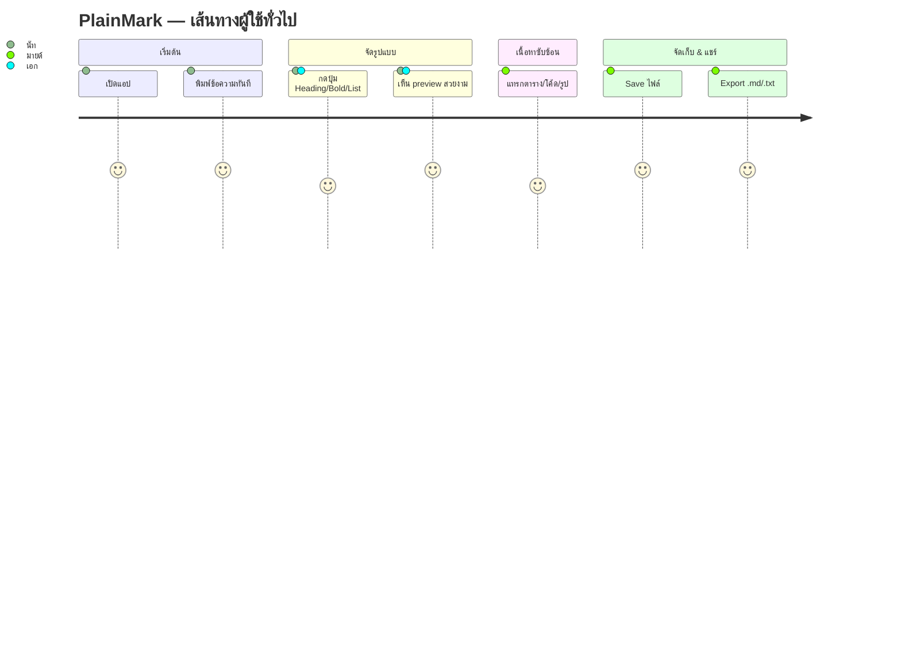

# User Journey — PlainMark

> เส้นทางการใช้งานของผู้ใช้ตั้งแต่เปิดแอปจนได้ผลลัพธ์ พร้อม flow diagram และ edge cases
> อ้างอิง personas จาก `PRD.md` ข้อ 4

---

## 1. หลักการออกแบบประสบการณ์ (UX Principles)

1. **Zero friction start** — เปิดแอป = พิมพ์ได้เลย ไม่มีหน้า welcome/setup ขวางทาง
2. **Type plain, see pretty** — พิมพ์ข้อความธรรมดา เห็น Markdown สวยทันทีด้านขวา
3. **Don't make me remember syntax** — ทุกรูปแบบมีปุ่ม + shortcut; tooltip บอกว่าปุ่มทำอะไร
4. **Never lose my work** — auto-save + กู้คืนเมื่อ crash + เตือนก่อนทิ้งงานที่ยังไม่บันทึก
5. **Plain text forever** — ผลลัพธ์เป็น `.txt`/`.md` เปิดที่ไหนก็ได้ ไม่ผูกขาด

---

## 2. Persona → เป้าหมายหลัก

| Persona | สถานการณ์ | สิ่งที่อยากได้ | Journey ที่เกี่ยวข้อง |
|---|---|---|---|
| **นัท** (สาย Notepad) | จด to-do/ไอเดียเร็วๆ | เปิดเร็ว พิมพ์เลย จัดหัวข้อง่าย | J1, J2 |
| **มายด์** (เขียนคู่มือ) | เขียน README/คู่มือสั้น | ตาราง/โค้ด/รูป + export `.md` | J3, J4, J5 |
| **เอก** (Markdown มือใหม่) | อยากเรียน Markdown | เห็นว่าปุ่มแทรกอะไร | J2 (ผ่าน tooltip/preview) |

---

## 3. Journey หลัก

### J1 — เปิดแอปครั้งแรกแล้วจดบันทึกทันที (นัท)
**เป้าหมาย:** จดข้อความสั้นๆ ให้เสร็จเร็วที่สุด

1. ดับเบิลคลิกไอคอน PlainMark
2. แอปเปิด < 1.5s → cursor อยู่ในช่อง editor เปล่าพร้อมพิมพ์ทันที
3. พิมพ์ข้อความปกติ เช่น `ของที่ต้องซื้อ` แล้วขึ้นบรรทัดใหม่พิมพ์ `นม` `ไข่`
4. เห็นด้านขวาแสดงข้อความ (ยังเป็น paragraph ธรรมดา)
5. ปิดแอป → auto-save เก็บไว้ให้ → เปิดใหม่เจอข้อความเดิม

**ผลลัพธ์:** จดได้เร็วเท่า Notepad, ไม่มีขั้นตอนเกินจำเป็น



---

### J2 — จัดรูปแบบโดยไม่ต้องจำ syntax (นัท / เอก)
**เป้าหมาย:** ทำให้รายการดูเป็นระเบียบ มีหัวข้อ + bullet โดยไม่พิมพ์ `#` หรือ `-`

1. มีข้อความ `ของที่ต้องซื้อ` อยู่ที่บรรทัดแรก → วาง cursor ที่บรรทัดนั้น
2. กดปุ่ม **Heading → H1** (หรือ `Ctrl+1`) บน Toolbar ด้านขวา
3. ระบบเติม `# ` ให้หน้าบรรทัด → ฝั่ง preview กลายเป็นหัวข้อตัวใหญ่ทันที
4. เลือกบรรทัด `นม` และ `ไข่` → กดปุ่ม **List → Bullet** (`Ctrl+Shift+L`)
5. ระบบเติม `- ` ให้แต่ละบรรทัด → preview กลายเป็น bullet list
6. ก่อนกดปุ่มที่ไม่คุ้น ผู้ใช้ **hover ค้างไว้** → ขึ้น tooltip ที่โชว์ **ตัวอย่างผลลัพธ์จริง** (เช่น ปุ่ม Quote โชว์กล่องคำอ้างอิงตัวอย่าง) + syntax + shortcut → รู้ทันทีว่ากดแล้วได้อะไร โดยไม่ต้องลองผิดลองถูก

**ผลลัพธ์:** จัดรูปแบบสำเร็จโดยไม่ต้องรู้ Markdown; เห็นตัวอย่างก่อนกดทำให้ไม่ต้องเดา และมือใหม่ค่อยๆ ซึมซับ syntax



---

### J3 — เขียนคู่มือที่มีตาราง + โค้ดบล็อก (มายด์)
**เป้าหมาย:** เขียนคู่มือสั้นที่มีตารางและตัวอย่างโค้ด

1. พิมพ์หัวข้อ + ย่อหน้าอธิบาย
2. กดปุ่ม **Table** → ระบบแทรก template ตาราง 2×2 พร้อม placeholder
3. แก้ข้อความในตาราง → preview แสดงตารางจัดเส้นสวยงาม
4. กดปุ่ม **Fenced Code Block** → เลือกภาษา (เช่น `bash`) → แทรก ` ```bash … ``` `
5. พิมพ์โค้ดข้างใน → preview แสดง code block พร้อม syntax highlighting
6. กดปุ่ม **Link** เพื่อใส่ลิงก์อ้างอิง

**ผลลัพธ์:** ได้เอกสารที่มี element ครบ โดยใช้ปุ่มแทนการพิมพ์ syntax ที่ซับซ้อน

---

### J3.5 — วางรูปจาก clipboard ทันที (มายด์)
**เป้าหมาย:** ใส่ภาพประกอบ/แคปหน้าจอลงคู่มือ โดยไม่ต้องเซฟไฟล์รูปก่อน

1. แคปหน้าจอ หรือก็อปรูปจากเว็บ/โปรแกรมอื่น (รูปอยู่ใน clipboard)
2. คลิกในช่อง editor ตำแหน่งที่อยากแทรก → กด `Ctrl+V`
3. ระบบอ่านรูปเป็น **base64** แล้วฝังลงเอกสารแบบ reference (`![วางรูปภาพ][img1]` + นิยาม base64 ท้ายไฟล์)
4. preview แสดงรูปทันที (ไม่มีไฟล์รูปแยก ไม่ต้องเซฟก่อน)
5. *ทางเลือก:* ลากไฟล์รูปจาก File Explorer มาวางในช่อง editor → เห็น drop zone แล้วฝังแบบเดียวกัน

**ผลลัพธ์:** ใส่ภาพได้เร็วเหมือนวางในแชต/เอกสาร — รูปติดไปกับไฟล์ `.md` เปิดที่อื่นก็ยังเห็น



---

### J4 — เปิดไฟล์เดิมมาแก้ไข (มายด์)
**เป้าหมาย:** กลับมาแก้คู่มือที่เคยเขียน

1. `Ctrl+O` หรือเมนู File → Open
2. เลือกไฟล์ `.md` จากเครื่อง
3. เนื้อหาแสดงในฝั่ง editor + preview render ทันที
4. แก้ไข → status bar ขึ้น "● Unsaved"
5. `Ctrl+S` บันทึกทับ → status เปลี่ยนเป็น "Saved"



---

### J5 — Export ออกไปใช้งานต่อ (มายด์)
**เป้าหมาย:** ส่งออกเป็น `.md` ไปใช้ใน Git repo และ `.txt` ส่งให้คนอื่น

1. เมนู File → Export
2. เลือกรูปแบบ: **Markdown (.md)** หรือ **Plain Text (.txt)**
3. เลือกตำแหน่งบันทึก → ระบบเขียนไฟล์
4. แจ้งผล "Exported to …"



---

## 4. Journey แบบ End-to-End (ภาพรวม)



---

## 5. Edge Cases & การรับมือ

| สถานการณ์ | พฤติกรรมที่คาดหวัง |
|---|---|
| ปิดแอปโดยมีงานยังไม่บันทึก | เตือน "มีการแก้ไขที่ยังไม่บันทึก — บันทึก / ทิ้ง / ยกเลิก" |
| แอป crash ระหว่างพิมพ์ | เปิดใหม่กู้คืนจาก auto-save อัตโนมัติ |
| เปิดไฟล์ที่ไม่ใช่ข้อความ (เช่น binary) | แจ้งเตือนว่าเปิดไม่ได้ ไม่ทำให้แอปค้าง |
| กดปุ่ม Bold ขณะไม่มี selection | แทรก `**\|**` แล้ววาง cursor ตรงกลางให้พิมพ์ต่อ |
| กด Heading ซ้ำบนบรรทัดที่เป็น heading อยู่แล้ว | วนระดับ H1→H2→…→H6→ปกติ (toggle) |
| วางข้อความยาวจาก clipboard | render preview แบบ debounce ไม่ค้างหน้าจอ |
| เอกสารใหญ่มาก (> 10,000 บรรทัด) | preview ยัง responsive (incremental render); แจ้งหากเกินขีดแนะนำ |
| แทรกรูปด้วย path ที่ไม่มีจริง | preview แสดง alt text + ไอคอนรูปเสีย ไม่ crash |
| วางรูปจาก clipboard (`Ctrl+V`) | ฝังเป็น base64 แบบ reference-style ทันที ไม่ต้องเซฟไฟล์ก่อน |
| วาง/ลางรูปขนาดใหญ่มาก | แจ้งเตือนขนาดไฟล์ที่จะเพิ่ม; ฝังได้แต่เตือนเรื่องไฟล์ `.md` ใหญ่ขึ้น |
| วาง content ที่ไม่ใช่รูป (ข้อความ/ไฟล์อื่น) | ทำงานเป็น paste ข้อความปกติ ไม่พยายามฝังเป็นรูป |
| สลับ Light/Dark theme | preview + editor เปลี่ยนธีมพร้อมกัน เนื้อหาคงเดิม |

---

## 6. ช่วงเวลาสำคัญที่วัดความสำเร็จ (Key UX Moments)

- **"Aha" moment:** ครั้งแรกที่กดปุ่ม Heading แล้วเห็นหัวข้อใหญ่โผล่ใน preview ทันที → เข้าใจคุณค่าของแอปทันที
- **Trust moment:** ปิดแอปแล้วเปิดใหม่ เจอข้อความเดิมครบ → เชื่อใจว่างานไม่หาย
- **Convenience moment:** แคปหน้าจอแล้ว `Ctrl+V` วางรูปลงโน้ตได้ทันทีโดยไม่ต้องเซฟไฟล์ → รู้สึกว่าลื่นเหมือนวางในแชต
- **Discovery moment:** hover ปุ่ม Toolbar แล้วเห็นตัวอย่างผลลัพธ์ → กล้ากดเพราะรู้ว่าจะได้อะไร
- **Power moment:** export `.md` ไปวางใน GitHub แล้วแสดงผลตรงกับที่เห็นใน preview → รู้สึกว่าใช้ทำงานจริงได้
